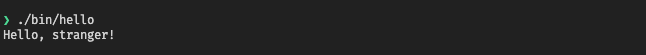

Go has some pretty good support/tools for cross-compiling binaries for multiple platforms/architectures. Just check the `$GOOS`/`$GOARCH` env vars listed in the [official documentation](https://golang.org/doc/install/source#environment).

But sometimes, you may need to use some lib/code written in C that hasn't been ported to Go. For this reason, there's [cgo](https://golang.org/cmd/cgo/), which you can use to call C code from your Go code. And while it can be straightforward to use when you run the binaries on the same platform you used to build them, it can be a bit of a mess when cross-compiling for platforms/architectures that are different.

Though, I hope that if you continue reading, it will become just a little easier.

## Prerequisites
Throughout this guide, we'll use Docker to build our binaries, so make sure you've installed the following:

1. [Docker](https://docs.docker.com/engine) >= `19.03.13`
2. [buildx](https://github.com/docker/buildx#installing) >= `v0.4.1`

You'll also need to [enable the experimental features for Docker]().

## Setup
Let's create a go project:
```bash
go mod init github.com/my-username/go-cross
```


Make sure you create a project dir for this and run the above command from the root of that dir.


Now let's create a simple `hello` package:
```go
// pkg/hello/hello.go
package hello

// #include <stdlib.h>
// #include <hello.h>
import "C"
import (
	"fmt"
	"unsafe"
)

func Greet(name string) {
	cs := C.CString(name)
	size := C.size_t(len(name))
	msg := C.greet(cs, size)
	fmt.Println(C.GoString(msg))
	C.free(unsafe.Pointer(cs))
}
```

And the C code that the package is referencing:
```c
// pkg/hello/hello.h
#ifndef HELLO_H_
#define HELLO_H_

#include <stdio.h>
#include <stdlib.h>

char *greet(const char *name, size_t size);

#endif
```

```c
// pkg/hello/hello.c
#include "hello.h"

char *greet(const char *name, size_t size)
{
  char *msg = malloc(size + 8);
  sprintf(msg, "Hello, %s!", name);
  return msg;
}
```

Now we need a simple cmd that uses the package:
```go
// cmd/hello/main.go
package main

import (
	"flag"

	"github.com/my-username/go-cross/pkg/hello"
)

func main() {
	flag.Parse()

	name := flag.Arg(0)
	if name == "" {
		name = "stranger"
	}

	hello.Greet(name)
}
```

And finally, we need a simple dockerfile to build our `hello` binary:
```dockerfile
# syntax = docker/dockerfile:1.1-experimental
# Dockerfile.hello
FROM golang:1.15-buster AS base

ENV GNU_HOST=arm-linux-gnueabi
ENV CC=$GNU_HOST-gcc

RUN apt-get update && \
  apt-get --no-install-recommends install -y gcc-$GNU_HOST \
    libc6-dev-armel-cross && \
  rm -rf /var/lib/apt/lists/*

WORKDIR /code

COPY ./go.mod .

ENV GO111MODULE=on

RUN --mount=type=cache,target=/go/pkg/mod \
  go mod download

FROM base AS builder

WORKDIR /code

ENV CGO_ENABLED=1
ENV GOARCH=arm
ENV GOOS=linux
ENV BIN_DIR /tmp/bin

COPY . .

RUN --mount=type=cache,target=/root/.cache/ \
  --mount=type=cache,target=/go/pkg/mod,ro \
  mkdir -p $BIN_DIR && \
  go build -mod readonly \
  -o $BIN_DIR/ \
  ./cmd/...

FROM scratch
COPY --from=builder /tmp/bin /
```

The project dir should end up similar to the following one:
```text
.
├── Dockerfile.hello
├── cmd
│   └── hello
│       └── main.go
├── go.mod
└── pkg
    └── hello
        ├── hello.c
        ├── hello.go
        ├── hello.h
```

## Build
Let's build the `hello` binary:
```bash
docker buildx build -f Dockerfile.hello -o type=local,dest=./bin .
```

If everything went well, you should find the binary in `./bin/`. Now just copy it to your target host and run it.

You could also build the binary on your host:
```bash
go build -race -o ./bin/hello cmd/hello/main.go
```

And run it to verify it works:


You can find the above project at [rolandjitsu/go-cross](https://github.com/rolandjitsu/go-cross). You'll also find how to use and statically link 3rd party libraries and how to setup a simple Github workflow to test the binaries.

That's all folks.
