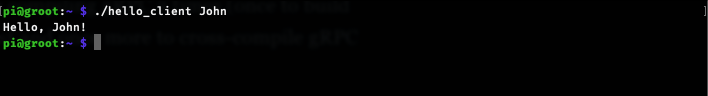
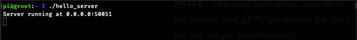

If you're building a micro-service architecture you'll most likely end up using some sort of networking lib to manage the communication between services.

This is where [gRPC](https://www.grpc.io/) fits in. I'm not gonna go through why it's a good choice, most of the time, but let's just say that interoperability between different programming languages becomes a lot better.

There's also a decent amount  of [documentation](https://www.grpc.io/docs/languages/) and a relatively large community where you can find help.

But when it comes to cross-compiling binaries that use gRPC for a different platform/architecture than your host (ARM in this case), it's not exactly straightforward to do.

Though, to be fair, there's a [cross-compile](https://github.com/grpc/grpc/blob/master/BUILDING.md#cross-compiling) section in the [building gRPC doc](https://github.com/grpc/grpc/blob/master/BUILDING.md) that leads to an [example](https://github.com/grpc/grpc/blob/master/test/distrib/cpp/run_distrib_test_raspberry_pi.sh) which is definitely very helpful. In fact, this post is just an adaptation of that example with a few improvements:
1. We'll use the arm-linux-gnueabihf cross-compiler toolchain instead of the one used in the example
2. We'll use Docker to build our binaries so that we can run this from any environment

## Prerequisites
Make sure you have the following tools installed on your machine:
1. [Docker](https://docs.docker.com/engine) >= `19.03.13`
2. [buildx](https://github.com/docker/buildx#installing) >= `v0.4.1`

## Setup a Docker builder
Create a Docker builder:
```bash
docker buildx create --name my-builder --driver docker-container --use
```

Then inspect and bootstrap it:
```bash
docker buildx inspect --bootstrap
```

## Setup a Dockerfile to build the binaries
Let's create a simple dockerfile which we'll use to compile our binaries:
```dockerfile
FROM debian:buster AS cross-grpc

ENV GNU_HOST=arm-linux-gnueabihf

RUN apt-get update && \
  apt-get --no-install-recommends install -y autoconf \
    automake \
    build-essential \
    cmake \
    gcc-$GNU_HOST \
    g++-$GNU_HOST \
    git \
    gnupg \
    libssl-dev \
    libtool \
    pkg-config \
    software-properties-common \
    wget && \
  rm -rf /var/lib/apt/lists/*

ENV C_COMPILER_ARM_LINUX=$GNU_HOST-gcc
ENV CXX_COMPILER_ARM_LINUX=$GNU_HOST-g++

ENV CROSS_TOOLCHAIN=/usr/$GNU_HOST
ENV CROSS_STAGING_PREFIX=$CROSS_TOOLCHAIN/stage
ENV CMAKE_CROSS_TOOLCHAIN=/arm.toolchain.cmake

# https://cmake.org/cmake/help/v3.13/manual/cmake-toolchains.7.html#cross-compiling-for-linux
RUN echo "set(CMAKE_SYSTEM_NAME Linux)" >> $CMAKE_CROSS_TOOLCHAIN && \
  echo "set(CMAKE_SYSTEM_PROCESSOR arm)" >> $CMAKE_CROSS_TOOLCHAIN && \
  echo "set(CMAKE_STAGING_PREFIX $CROSS_STAGING_PREFIX)" >> $CMAKE_CROSS_TOOLCHAIN && \
  echo "set(CMAKE_SYSROOT ${CROSS_TOOLCHAIN}/sysroot)" >> $CMAKE_CROSS_TOOLCHAIN && \
  echo "set(CMAKE_C_COMPILER /usr/bin/$C_COMPILER_ARM_LINUX)" >> $CMAKE_CROSS_TOOLCHAIN && \
  echo "set(CMAKE_CXX_COMPILER /usr/bin/$CXX_COMPILER_ARM_LINUX)" >> $CMAKE_CROSS_TOOLCHAIN && \
  echo "set(CMAKE_FIND_ROOT_PATH_MODE_PROGRAM NEVER)" >> $CMAKE_CROSS_TOOLCHAIN && \
  echo "set(CMAKE_FIND_ROOT_PATH_MODE_LIBRARY ONLY)" >> $CMAKE_CROSS_TOOLCHAIN && \
  echo "set(CMAKE_FIND_ROOT_PATH_MODE_INCLUDE ONLY)" >> $CMAKE_CROSS_TOOLCHAIN && \
  echo "set(CMAKE_FIND_ROOT_PATH_MODE_PACKAGE ONLY)" >> $CMAKE_CROSS_TOOLCHAIN

ENV GRPC_VERSION=v1.32.0

# https://github.com/grpc/grpc/blob/master/test/distrib/cpp/run_distrib_test_raspberry_pi.sh
RUN GRPC_DIR=/grpc && \
  git clone --depth 1 --branch $GRPC_VERSION --recursive --shallow-submodules https://github.com/grpc/grpc.git $GRPC_DIR && \
  # gRPC on the host
  GRPC_BUILD_DIR=$GRPC_DIR/cmake/build && \
  mkdir -p $GRPC_BUILD_DIR && \
  cd $GRPC_BUILD_DIR && \
  cmake \
    -DCMAKE_BUILD_TYPE=Release \
    -DgRPC_INSTALL=ON \
    -DgRPC_BUILD_TESTS=OFF \
    -DgRPC_SSL_PROVIDER=package \
    ../.. && \
  make -j`nproc` install && \
  # gRPC cross
  GRPC_CROSS_BUILD_DIR=$GRPC_DIR/cmake/cross_build && \
  mkdir -p $GRPC_CROSS_BUILD_DIR && \
  cd $GRPC_CROSS_BUILD_DIR && \
  cmake -DCMAKE_TOOLCHAIN_FILE=$CMAKE_CROSS_TOOLCHAIN \
    -DCMAKE_BUILD_TYPE=Release \
    -DCMAKE_INSTALL_PREFIX=$CROSS_TOOLCHAIN/grpc_install \
    ../.. && \
  make -j`nproc` install && \
  cd / && \
  rm -rf $GRPC_DIR

FROM cross-grpc AS builder

WORKDIR /code

COPY ./src/. .

ENV BIN_DIR=/tmp/bin
ENV BUILD_DIR=./build

RUN mkdir -p $BIN_DIR && \
  mkdir -p $BUILD_DIR && \
  cd ./$BUILD_DIR && \
  cmake -DCMAKE_TOOLCHAIN_FILE=$CMAKE_CROSS_TOOLCHAIN \
    -DCMAKE_BUILD_TYPE=Release \
    -DProtobuf_DIR=$CROSS_STAGING_PREFIX/lib/cmake/protobuf \
    -DgRPC_DIR=$CROSS_STAGING_PREFIX/lib/cmake/grpc \
    ..  && \
  make -j`nproc` && \
  cp ./hello_* $BIN_DIR/

FROM scratch
COPY --from=builder /tmp/bin /
```

The above dockerfile has 3 stages:
1. A cross-compilation environment (build tools, cross-compilers, cmake cross-compilation toolchain, gRPC and dependencies cross-compiled) 
2. A build env based on the above stage that builds the binaries
3. An empty image where our binaries will copied to from the previous stage

## Write a little Hello app

Now let's create a simple app that we'll use to test our cross-compilation process.

Create a simple proto file:
```proto
// src/hello.proto
syntax = "proto3";

package hello;

service Greeter {
  rpc SayHello (Req) returns (Rep) {}
}

message Req {
  string name = 1;
}

message Rep {
  string message = 1;
}
```

A server that will reply to client requests:
```cpp
// src/hello_server.cc
#include <iostream>
#include <memory>
#include <string>

#include <grpcpp/grpcpp.h>
#include <grpcpp/health_check_service_interface.h>
#include <grpcpp/ext/proto_server_reflection_plugin.h>

#include "hello.grpc.pb.h"

class GreeterService final : public hello::Greeter::Service
{
  grpc::Status SayHello(grpc::ServerContext *ctx, const hello::Req *req,
                        hello::Rep *rep) override
  {
    std::string prefix("Hello, ");
    std::string suffix("!");
    rep->set_message(prefix + req->name() + suffix);
    return grpc::Status::OK;
  }
};

void RunServer()
{
  std::string addr("0.0.0.0:50051");
  GreeterService service;

  grpc::EnableDefaultHealthCheckService(true);
  grpc::reflection::InitProtoReflectionServerBuilderPlugin();

  grpc::ServerBuilder builder;
  // No auth
  builder.AddListeningPort(addr, grpc::InsecureServerCredentials());
  // Register the service
  builder.RegisterService(&service);

  // Start server
  std::unique_ptr<grpc::Server> server(builder.BuildAndStart());
  std::cout << "Server running at " << addr << std::endl;

  // Wait for shutdown
  server->Wait();
}

int main(int argc, char **argv)
{
  RunServer();
  return 0;
}
```

And the client we'll use to make requests:
```cpp
// src/hello_client.cc
#include <ctype.h>
#include <stdio.h>
#include <stdlib.h>

#include <iostream>
#include <memory>
#include <string>

#include <grpcpp/grpcpp.h>
#include "hello.grpc.pb.h"

class GreeterClient
{
public:
  GreeterClient(std::shared_ptr<grpc::Channel> channel)
      : stub_(hello::Greeter::NewStub(channel)) {}

  std::string SayHello(const std::string &name)
  {
    hello::Req req;
    req.set_name(name);

    hello::Rep rep;
    grpc::ClientContext context;

    grpc::Status status = stub_->SayHello(&context, req, &rep);

    if (status.ok())
      return rep.message();
    else
    {
      std::cout << "Error " << status.error_code() << ": "
                << status.error_message()
                << std::endl;
      return "RPC failed";
    }
  }

private:
  std::unique_ptr<hello::Greeter::Stub> stub_;
};

int main(int argc, char **argv)
{
  std::string addr("127.0.0.1:50051");

  std::string name("stranger");
  if (argc > 1)
    name = std::string(argv[1]);

  std::shared_ptr<grpc::Channel> chan;
  chan = grpc::CreateChannel(addr, grpc::InsecureChannelCredentials());

  GreeterClient greeter(chan);

  std::string rep = greeter.SayHello(name);
  std::cout << rep << std::endl;

  return 0;
}
```

There's not much going on above, just a simple server that will respond with `Hello, <name>!` to client requests and gRPC facilitating the communication between the two.

We'll also need a cmake config that can find the necessary dependencies and generate the sources from our proto file:
```cmake
# src/CMakeLists.txt
cmake_minimum_required(VERSION 3.5.1)

# For Protobuf's cmake warnings
if(POLICY CMP0077)
  cmake_policy(SET CMP0077 NEW)
endif()

project(hello C CXX)
set(CMAKE_CXX_FLAGS "${CMAKE_CXX_FLAGS} -std=c++11")

find_package(Threads REQUIRED)

# Find Protobuf installation
# Looks for protobuf-config.cmake file installed by Protobuf's cmake installation.
set(protobuf_MODULE_COMPATIBLE TRUE)
find_package(Protobuf CONFIG REQUIRED)
message(STATUS "Using protobuf ${Protobuf_VERSION}")

set(_PROTOBUF_LIBPROTOBUF protobuf::libprotobuf)
set(_REFLECTION gRPC::grpc++_reflection)
find_program(_PROTOBUF_PROTOC protoc)

# Find gRPC installation
# Looks for gRPCConfig.cmake file installed by gRPC's cmake installation.
find_package(gRPC CONFIG REQUIRED)
message(STATUS "Using gRPC ${gRPC_VERSION}")

set(_GRPC_GRPCPP gRPC::grpc++)
find_program(_GRPC_CPP_PLUGIN_EXECUTABLE grpc_cpp_plugin)

# Protos
get_filename_component(h_proto "hello.proto" ABSOLUTE)
get_filename_component(h_proto_path "${h_proto}" PATH)

# Generated sources
set(h_proto_srcs "${CMAKE_CURRENT_BINARY_DIR}/hello.pb.cc")
set(h_proto_hdrs "${CMAKE_CURRENT_BINARY_DIR}/hello.pb.h")
set(h_grpc_srcs "${CMAKE_CURRENT_BINARY_DIR}/hello.grpc.pb.cc")
set(h_grpc_hdrs "${CMAKE_CURRENT_BINARY_DIR}/hello.grpc.pb.h")
add_custom_command(
  OUTPUT "${h_proto_srcs}" "${h_proto_hdrs}" "${h_grpc_srcs}" "${h_grpc_hdrs}"
  COMMAND ${_PROTOBUF_PROTOC}
  ARGS --grpc_out "${CMAKE_CURRENT_BINARY_DIR}"
    --cpp_out "${CMAKE_CURRENT_BINARY_DIR}"
    -I "${h_proto_path}"
    --plugin=protoc-gen-grpc="${_GRPC_CPP_PLUGIN_EXECUTABLE}"
    "${h_proto}"
  DEPENDS "${h_proto}")

# Generated sources headers
include_directories("${CMAKE_CURRENT_BINARY_DIR}")

# Targets (the binaries)
foreach(_target
  hello_client hello_server)
  add_executable(${_target} "${_target}.cc"
    ${h_proto_srcs}
    ${h_grpc_srcs})
  target_link_libraries(${_target}
    ${_REFLECTION}
    ${_GRPC_GRPCPP}
    ${_PROTOBUF_LIBPROTOBUF})
endforeach()
```

## Compile the binaries
All that's left to do is to compile our binaries:
```bash
docker buildx build -f Dockerfile -o type=local,dest=./bin .
```


This may take some time as we're compiling gRPC 2 times (once to build the protoc and gRPC programs for the host and once more to cross-compile gRPC for our target architecture). But subsequent runs will be fast if there's no changes to the dockerfile.


After the build command is done, you should have two binaries in the `./bin` folder. Copy both to your ARM host and run them. You should see something similar to:




That's it. I hope you found this helpful. You can also find all the source code and some tests at [rolandjitsu/grpc-cross-arm](https://github.com/rolandjitsu/grpc-cross-arm).
