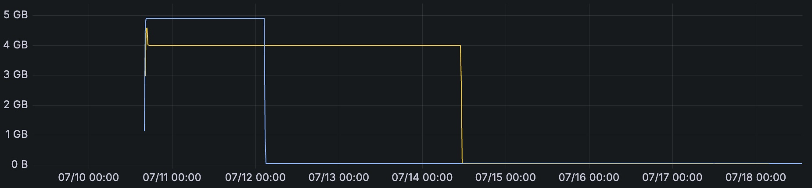
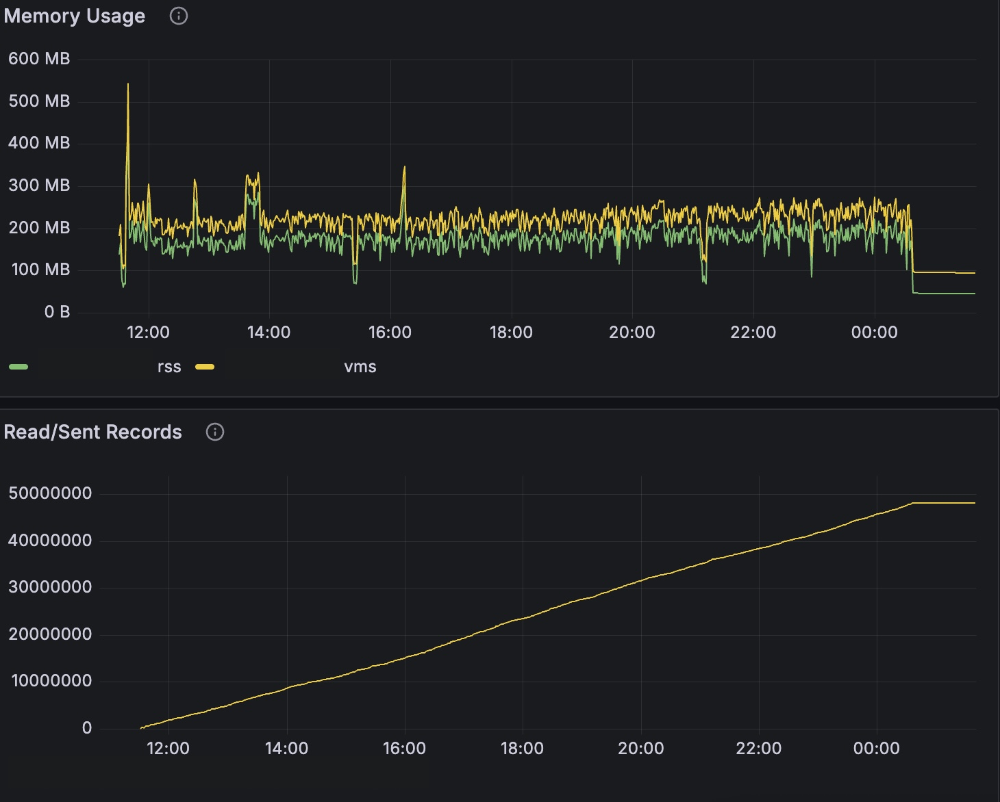

I had a Rust service that ate memory for breakfast. The fix that helped the most, I stumbled into completely by accident - and it had nothing to do with the code I'd been sweating over :sweat_smile: .

Here's the whole embarrassing, hopefully useful story.

## The setup

The service was a data collector - high-throughput ingest with backpressure, checkpointing, retries, the usual. The design was simple: one thread reads batches of records off a source on a tick, hands them to another thread over a channel, and that thread ships them to a destination.


flowchart LR
    R["Read thread (polls source each tick)"] -->|"batch of records over an mpsc"| W["Write thread (ships data to destination)"]


The batch is a `Vec<Data>`, and the buffering (and backpressure) all happens in that channel. It pulled records every 50ms or so and kept going until there was nothing left to read - for a big backlog, that could mean chewing through hundreds of millions of records over the better part of a day.

And it was *hungry*. When things got busy it would climb to around 4.5GB. I wanted it bounded, and much smaller.



## Round 1: stop bounding by count, start bounding by bytes

Here's the trap I'd already walked into. We *had* a bounded channel - buffered, with a deliberately low limit. Data arrived chunked (batches of ~100 records, with the buffer capped around 32 chunks in flight). On paper that's a nice, small, bounded queue.

The catch: we were bounding by **count**. And a single record could easily be ~10MB. So "32 chunks" wasn't a few megabytes - it could quietly mean *hundreds* of megabytes sitting in memory. Count-based bounds lie to you the moment item sizes vary.

So I built a **byte-aware channel**: bound the queue by *accumulated bytes*, not messages. Two pieces. First, anything flowing through has to estimate its own size:

```rust
/// Everything we push through the channel can estimate its own heap size.
trait SizeEstimate {
    fn estimated_size(&self) -> usize;
}
```

Second, the accounting. Instead of tracking bytes by hand, I leaned on a semaphore as a **byte budget**: one permit == one byte. To send a value, you acquire as many permits as it has bytes; the permits ride along with the value and are released when the consumer drops it. That release *is* the backpressure - a big item in flight starves new sends until it's processed.

```rust
use std::sync::Arc;
use tokio::sync::{mpsc, OwnedSemaphorePermit, Semaphore};

/// The value travels with the permits that account for its bytes. When the
/// consumer drops this, the permits return to the semaphore and free up
/// budget for the next send.
struct Metered<T> {
    value: T,
    _bytes: OwnedSemaphorePermit,
}

#[derive(Clone)]
struct ByteSender<T> {
    tx: mpsc::Sender<Metered<T>>,
    budget: Arc<Semaphore>, // total permits == byte budget
}

impl<T: SizeEstimate> ByteSender<T> {
    /// Waits until there's enough byte budget, then sends.
    async fn send(&self, value: T) -> Result<(), mpsc::error::SendError<T>> {
        let bytes = value.estimated_size().max(1) as u32;
        let permit = Arc::clone(&self.budget)
            .acquire_many_owned(bytes)
            .await
            .expect("budget semaphore closed");
        self.tx
            .send(Metered { value, _bytes: permit })
            .await
            .map_err(|e| mpsc::error::SendError(e.0.value))
    }
}
```

Two things worth calling out:

- `acquire_many` takes a `u32`, so one-permit-per-byte works up to a ~4GB budget. Past that, count in kilobytes instead.
- **Mind the oversized item.** If a single value is larger than the *entire* budget, its `acquire_many` can never be satisfied - instant deadlock. Your budget has to exceed your largest possible item (or you special-case the big ones). Given a single record could be ~10MB, this wasn't hypothetical.

With the pipeline capped by real bytes, memory dropped to ~2.5GB (virtual). Progress! But not the win I wanted.

## Round 2: fewer clones, more references

Next I went after the data-parsing path: cut needless clones, pass references, move data through memory instead of copying it. All good hygiene.

It helped... less than I'd hoped. I was starting to run out of obvious ideas.

## The accident

Then, while testing, I pushed a *manually built* binary to a device - and watched memory fall off a cliff. From over 1GB to **under 100MB**, mid-ingest. And it wasn't just virtual: resident memory (RSS) also dropped.

*wtf.* :exploding_head:

My first thought was "did my changes finally kick in?" No - way too big, way too sudden. Confused, I ran `ldd` on the binary out of pure curiosity:

```text
$ ldd ./my-service
        not a dynamic executable
```

Nothing linked. It was a **static binary** - and noticeably smaller on disk. I checked on a different device where the binary was built/shipped via the CI and, sure enough, it was dynamically linked against the system libc and friends.

 and RSS (green) both fall (RSS is less obvious here - barely noticeable). The logging fix below hadn't landed yet.")

The difference: my manual build produced a statically linked **musl** binary, while our CI and build tooling link against **glibc** with shared libraries. Same code, different libc, wildly different memory.

## Why it happened

A bit of reading pointed at the culprit: **glibc and musl size thread memory very differently.** glibc is generous with per-thread arenas and stack reservations; musl is far more frugal.

And I had *threads* - roughly 16: the async runtime (tokio), an embedded store, and a few others. It turned out a big chunk of what I'd been calling "my memory usage" wasn't the data pipeline at all. It was threads and libc.

A note on VMS vs. RSS, because it's easy to overstate this: glibc's arenas *reserve* address space it may never fault in, so some of the VMS drop is just accounting. But here **RSS dropped too** - the shape followed the VMS - so this was a real resident win, not a virtual-memory mirage. With ~16 threads, glibc's per-thread overhead was costing actual pages, and musl simply doesn't reserve as much. Measure both numbers so you know which kind of win you've got; this one was both.

## The other culprit: logging

musl wasn't the whole story. When the service was busy, our [`tracing`](https://docs.rs/tracing/) setup at `trace` level was holding on the order of **~1GB** on its own. Verbose subscribers aren't free - under high throughput, all that structured logging adds up fast.

The fix was cheap: make the log level **switchable at runtime**, and run `info` in prod - keeping `trace` a flip away for when you actually need to dig. That alone clawed back most of the difference.

. Bottom: records sent - the yellow line climbs steadily, and once it flattens the backlog is drained and memory falls off.")



## Other approaches I considered

I didn't land on the byte-aware channel because it was the only option - it's just the one I could ship without rearchitecting. A few others I considered:

1. **Count bytes by hand on both ends.** Measure before pushing to the channel, stop at the max, and have the consumer ack how many bytes actually made it over the wire so the reader can subtract them - a shared counter between the read and write threads. It works, but it defeats the point: if I'm bolting my own sync on top, why use a channel at all?
2. **Encode to the wire shape before the channel.** Parse and encode into the exact bytes that go over the network *before* sending, so the size is true rather than estimated. More accurate, but it couples the reader to what the consumer does with the data. (One shape end-to-end would've been cleaner, but the source and destination shapes were genuinely different.)
3. **Ditch the channel entirely** and write a custom, byte-aware buffer.

Reworking the architecture wasn't something I could take on at that point, and there are probably better designs than any of these. But once optimized, what I had worked just fine - and "works fine, shipped" beats "perfect, someday."

## What I took away from it

1. **Build the same way everywhere.** The single most useful fix came from a build path that didn't match CI. If dev, CI, and prod don't build identically, you're setting yourself up for exactly this kind of surprise - a happy one this time, but it could just as easily have gone the other way.
2. **musl is frugal with thread memory** - and hands you a smaller binary as a bonus. If your service is thread-heavy, the libc you link against can matter more than your code.
3. **Static binaries are great when you want a self-contained artifact with zero OS dependencies** - but they can get large if you link in a lot of deps. Tradeoffs, always.
4. **Verbose logging isn't free.** A `trace`-level subscriber under load was worth ~1GB by itself. Make your log level tunable at runtime: crank it when you're debugging, keep it sane in prod.

The takeaway: I spent days optimizing the thing I *assumed* was the problem (my pipeline), and the biggest wins came from things I wasn't even looking at - the toolchain and the logger. Sometimes the fastest way to cut memory isn't in your code at all.
