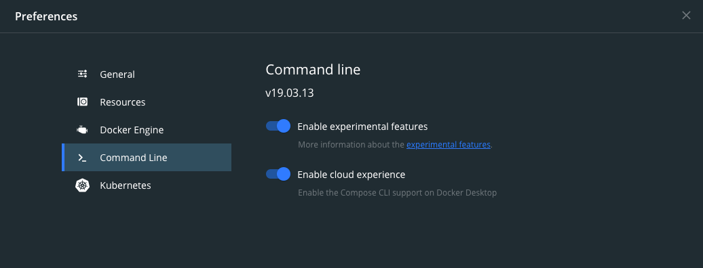
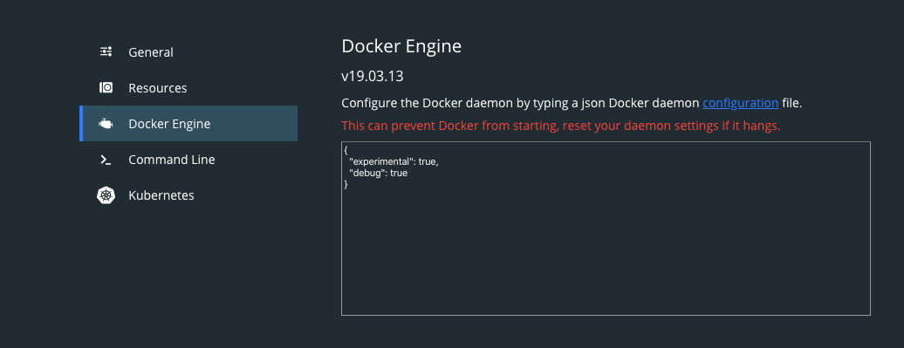

If you landed on this page, it means you probably have the same issue I've stumbled upon as well: I need to access some private Github repos while building a docker image but I don't want any ssh keys or credentials to end up in the final image.

While there's already [ways to achieve this](https://vsupalov.com/build-docker-image-clone-private-repo-ssh-key/), the recent additions of [buildx](https://github.com/docker/buildx) (first release was back in [April 2019](https://github.com/docker/buildx/releases/tag/v0.2.0)) and [experimental dockerfile syntaxes](https://github.com/moby/buildkit/blob/master/frontend/dockerfile/docs/experimental.md) (available from `v18.06` onwards) make it much easier to do it (or just more elegant).

Do note that you need to have Docker `18.09+` installed and you need to enable the experimental features for Docker (both for the CLI and the daemon).

To enable the experimental features for the CLI, you just need to add the following to your `~/.docker/config.json` config:
```json
{
  "experimental": "enabled"
}
```


If you're using the Docker Desktop version, this option might already be available under `Preferences > Command Line` (see image below).




And to enable the experimental features for the daemon, you need to add the following to your `/etc/docker/daemon.json` config:
```json
{
  "experimental": true
}
```


The above config file path is for docker running on Linux. If you're running docker on macOS, you might find this config at `~/.docker/daemon.json`. Or if you're using the Desktop version, you'll find these settings under `Preferences > Docker Engine` (see image below).




Furthermore, if you're not using  a Linux machine, you need to start the [ssh-agent](https://www.ssh.com/ssh/agent):
```bash
eval $(ssh-agent)
```

And add your current SSH key to the agent:
```bash
ssh-add ~/.ssh/id_rsa
```

We also need to setup a `known_hosts` file to avoid prompts from SSH when cloning:
```bash
ssh-keyscan github.com >> ./known_hosts
```

Now create a dockerfile that just clones a private repo:
```dockerfile
# syntax = docker/dockerfile:1.1-experimental
# Dockerfile.priv-repo
FROM alpine
ARG PRIV_GIT_REPO

RUN apk add --update --no-cache ca-certificates \
  git \
  openssh-client \
  rsync

ENV PRIV_SOURCE_CODE /code

RUN --mount=type=ssh \
    --mount=type=secret,id=known_hosts,dst=/root/known_hosts \
    mkdir -p -m 0700 /root/.ssh && \
    cat /root/known_hosts >> /root/.ssh/known_hosts && \
    git config --global url."git@github.com:".insteadOf "https://github.com/" && \
    git clone $PRIV_GIT_REPO $PRIV_SOURCE_CODE
```

And build a base image off that which we'll use in another image:
```bash
docker buildx build -f Dockerfile.priv-repo \
    --ssh default \
    --secret id=known_hosts,src=./known_hosts \
    --build-arg PRIV_GIT_REPO=<my private repo> \
    --tag priv-repo \
    .
```

Lastly, create a dockerfile that copies whatever was in the private repo to the host:
```dockerfile
# Dockerfile
FROM priv-repo AS builder

RUN rsync -rv --exclude '.git' $PRIV_SOURCE_CODE/ /tmp/

FROM scratch
COPY --from=builder /tmp/ /
```

And build the image to get the output:
```bash
docker buildx build -f Dockerfile -o type=local,dest=./priv-code .
```

If everything went well, you should see the private repo's content under `./priv-code`.

Things to note:
* The above guide will only work for Github, though, with slight changes it can work for GitLab or others
* We're using the [secret](https://github.com/moby/buildkit/blob/master/frontend/dockerfile/docs/experimental.md#run---mounttypesecret) feature to pass the `known_hosts` file to the base image, but we can easily run the `ssh-keyscan` just before the `git clone ...`
* We're configuring git to use SSH when cloning, but this might not work for everyone
* This guide has not been tested Windows

Finally, you can find this example at [rolandjitsu/docker-ssh](https://github.com/rolandjitsu/docker-ssh). The repo also includes examples of how to use the [bake](https://github.com/docker/buildx/#buildx-bake-options-target) command and how a [Github action](https://github.com/features/actions) that uses this approach would look like.
